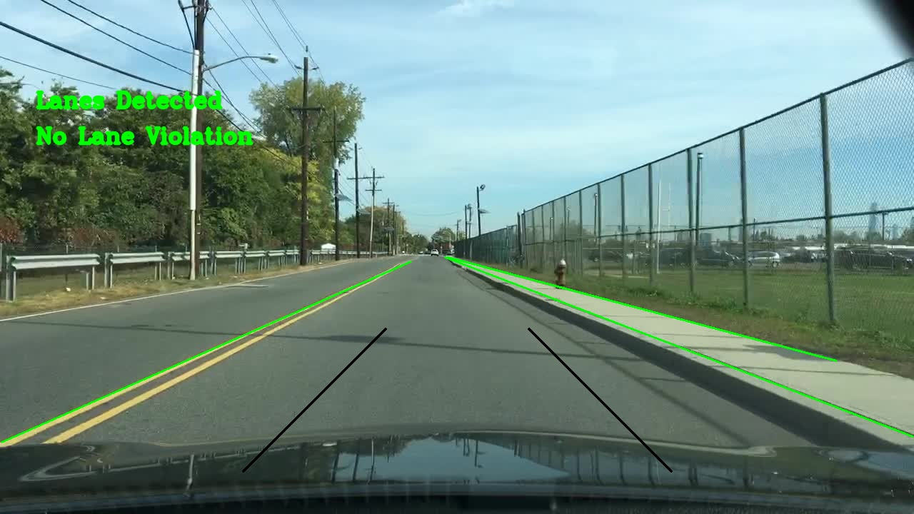
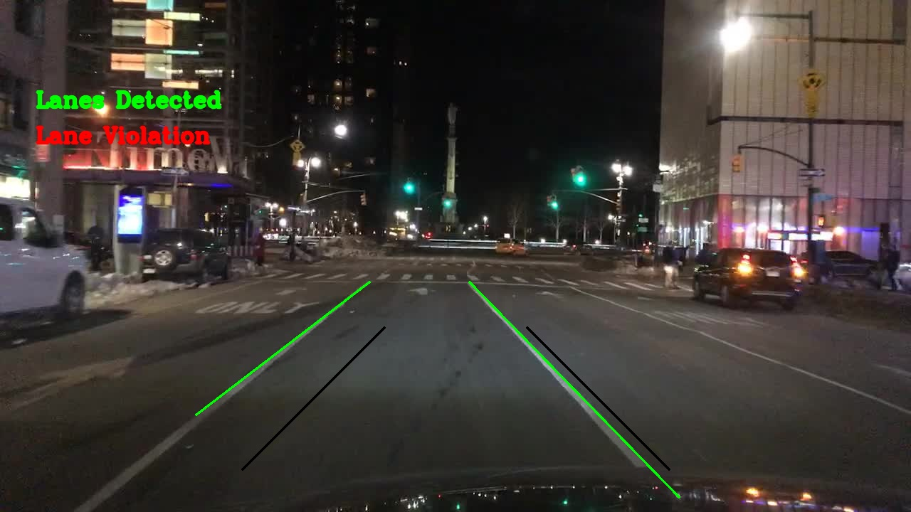

# Lane Detection and Violation Detection Using OpenCV

## Overview

This project implements a **lane detection and vehicle lane violation detection system** using Python and OpenCV. It processes images of roads, detects lane lines using **Canny edge detection** and **Hough Transform**, filters and merges detected lines, and determines whether a vehicle is violating lane boundaries based on tire line positions.

The system is designed for batch processing of images and outputs annotated images highlighting detected lanes and any violations.

---

## Features

* **Grayscale Conversion** – Converts input images to grayscale for processing.
* **Noise Reduction** – Applies Gaussian blur to reduce noise and improve edge detection.
* **Canny Edge Detection** – Detects edges in the image for subsequent line detection.
* **Region of Interest Masking** – Focuses on the road region, ignoring irrelevant areas.
* **Hough Line Transform** – Detects straight lines in the masked edge image.
* **Line Post-Processing**

  * Removes horizontal lines that do not correspond to road lanes.
  * Merges lines that are close to each other and have similar slopes to improve detection.
* **Lane Line Selection** –

  * Identifies the line closest to the image center on the right half.
  * Identifies the line closest to the image center on the left half.
* **Lane Violation Detection** – Checks if a vehicle’s tire lines cross lane boundaries.
* **Visualization and Output** – Draws lanes, tire lines, and violation status on the original image and saves the output.

---

## Functions Overview

### `process_image(filename)`

Main function that processes a single image. Steps include:

1. Load and validate image.
2. Convert to grayscale and apply Gaussian blur.
3. Perform Canny edge detection.
4. Mask the region of interest (road area).
5. Apply Hough Transform to detect lines.
6. Post-process lines to remove horizontal lines and merge close, similar lines.
7. Identify left and right lane lines relative to the image center.
8. Check for lane violation based on vehicle tire lines.
9. Draw lane lines, tire lines, and violation status on the image.
10. Save the annotated image to the `output/` folder.

---

### `post_process_lines_1(lines)`

* Removes horizontal lines that do not represent road lanes.
* Uses a slope threshold to filter near-horizontal lines.

### `post_process_lines_2(lines, slope_thresh, dist_thresh)`

* Filters horizontal lines and merges lines that are close together and have similar slopes.
* Reduces fragmented line segments to improve lane detection.

### `get_leftmost_in_right_half(img, lines)` & `get_rightmost_in_left_half(img, lines)`

* Determine the line closest to the center on the right and left halves of the image, respectively.

### `is_violation(left_tyre_line, right_tyre_line, left_line, right_line)`

* Checks if the tire lines are outside the detected lane lines. Returns `True` for a lane violation.

### `region_selection(img)`

* Masks the lower half of the image (assumed road region) to focus detection on the relevant area.

---

## Assumptions
This implementation assumes that the vehicle dashcam is installed at the very centre of windscreen.

## Dataset for Dashcam Images
[Dataset](https://www.kaggle.com/datasets/mdfahimbinamin/100k-vehicle-dashcam-image-dataset/data)